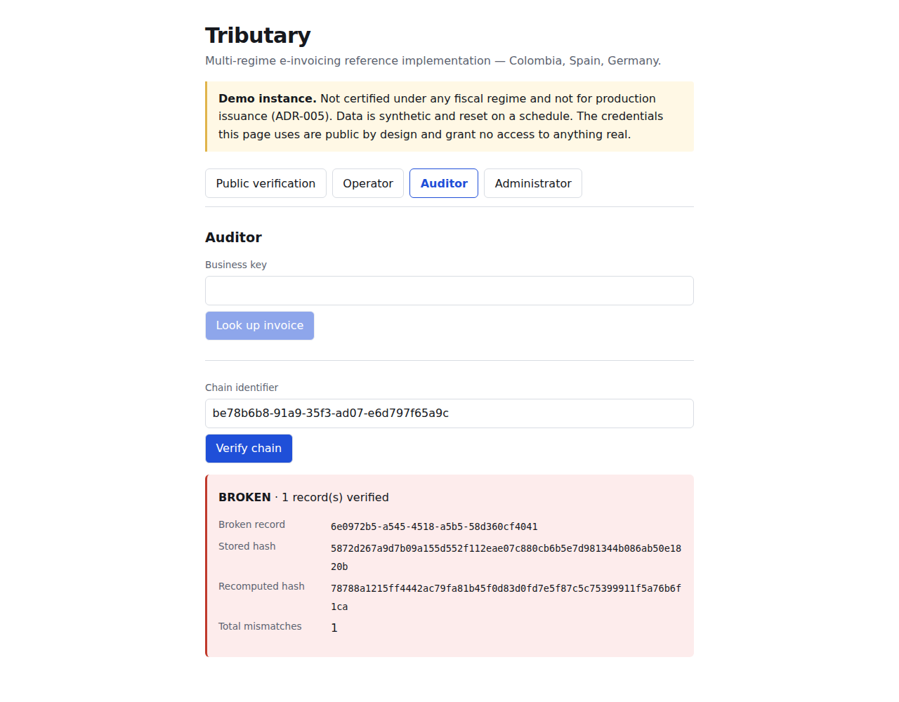
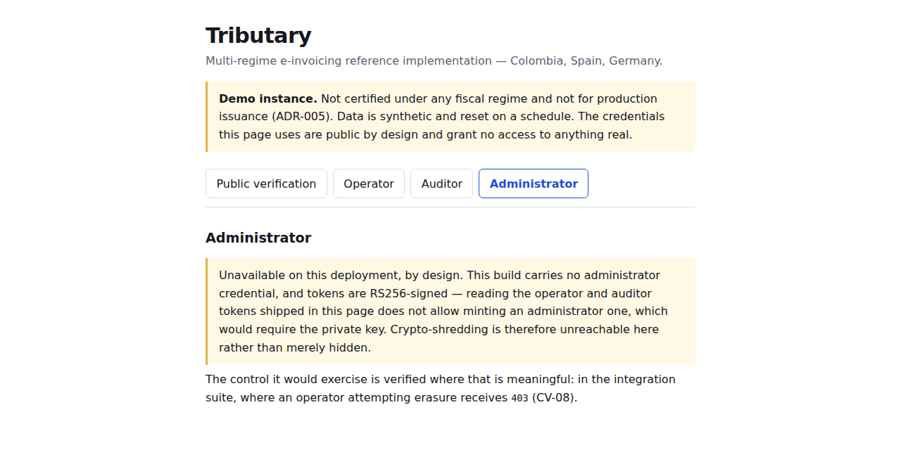

# Tributary

[](https://github.com/Luisceron0/Tributary/actions/workflows/ci.yml)
[](LICENSE)

**A multi-regime e-invoicing engine that treats "this fiscal document cannot be altered" as a
database guarantee, not an application promise.**

Reference implementation · Colombia (Factus/DIAN) · Spain (Verifactu) · Germany (XRechnung) ·
hexagonal architecture, 303 automated tests, thirteen independently verified security controls.

A cross-border B2B sale creates simultaneous tax obligations in jurisdictions whose technical
models are incompatible: Colombia clears invoices before they legally exist, Spain requires a
hash-chained invoicing record, Germany requires a structured document handed to the buyer.
Tributary models the business fact once and delegates the translation to per-regime adapters.

The thesis: a fiscal document is an immutable fact, correctable only by a later document that
references it — and that invariant belongs in the layer no application path can bypass. In this
system that layer is PostgreSQL, not Java ([ADR-002](docs/adr/ADR-002-chain-integrity-in-postgresql.md)).

That isn't a design intention; it's live, running behavior — try it yourself in the
[quickstart](#quickstart) below, or read the proof first:

### Tamper evidence (CV-02 / CV-03)

Register and issue an invoice, then try to edit the resulting fiscal record directly in the
database — the way a support script, a hot fix, or a careless migration would:

```sql
UPDATE fiscal_record SET canonical_payload = 'tampered'
WHERE id = '43d148ee-c723-4320-a51a-a17d5bcf7c8d';
```

```
ERROR:  fiscal_record is immutable: UPDATE is not permitted on row
        43d148ee-c723-4320-a51a-a17d5bcf7c8d (fiscal_record).
        A correction is a NEW row that references this one (RF-004), never an edit.
```

Rejected by a PostgreSQL trigger — not an application-layer check, so it holds even against a
`psql` session with valid credentials and zero application code in the path. Now disable the
trigger, tamper directly, and ask the system's own verifier — not the trigger — whether the chain
still holds:

```
GET /api/v1/chains/{chainId}/verification
```
```json
{
  "status": "BROKEN",
  "brokenRecordId": "43d148ee-c723-4320-a51a-a17d5bcf7c8d",
  "storedHash": "671bf057e04a821969219875a29b89069a5dded0a3492316039d9ce6f0492b09",
  "recomputedHash": "9626d235dae15d6ffa22b5a1f2be50744af3541c1e8fc5a4054cbc3f535aa7ea",
  "totalMismatches": 1
}
```

The verifier recomputes every hash from the stored canonical payload and names the exact record
where it stops matching — not "something is wrong somewhere," a specific row ID. Reproduce this
yourself with the [quickstart](#quickstart) below; both outputs above are real, from that same
stack.

The same verification through the web interface, driven in a real browser against the running
stack:



**Contents:** [Scope and honesty](#scope-and-honesty) · [Interface](#interface) ·
[Quickstart](#quickstart) · [Architecture](#architecture) · [Security](#security) ·
[API contract](#api-contract) · [Dependencies](#dependencies) · [Documentation](#documentation)

## Scope and honesty

> This is a reference implementation built against public specifications. It is **not certified**
> under any fiscal regime and must not be used to issue invoices in production.

- **Colombia (Factus/DIAN):** issues real, clearing-based invoices against the Factus sandbox.
  This is the one regime where a live CUFE is actually obtainable and verified (CV-10).
- **Spain (Verifactu):** builds and hash-chains fiscal records, generates the RD 1007/2023 QR.
  **Does not** submit anything to the AEAT — that requires a qualified certificate and a formal
  *declaración responsable* as a software producer, a commitment this project doesn't make.
  The QR points at this system's own verifier, never at an AEAT host
  ([ADR-005](docs/adr/ADR-005-es-adapter-does-not-remit.md),
  [ADR-007](docs/adr/ADR-007-es-qr-points-to-self.md)).
- **Germany (XRechnung):** builds and validates EN 16931/CII documents against the official KoSIT
  validator. **Does not** transport them over Peppol.

No README, log message, response field, or comment in this codebase describes the system as
compliant or certified under any regime — verified by static rules, not just discipline
(see [Security](#security)).

## Interface

A small React interface ([ADR-010](docs/adr/ADR-010-web-frontend-demo-mode.md)) covers the same
eight endpoints, one panel per role, plus the public verification page a scanned QR now lands on.

**Authentication is demo mode: there is no login.** The page carries pre-minted tokens, which
means anyone can read them — so a public build deliberately carries **no administrator
credential**. That is a cryptographic limit rather than a UI one: tokens are RS256-signed, so
reading the operator and auditor tokens cannot produce an administrator one without the private
key, which never ships. Crypto-shredding is unreachable on such a build rather than merely
hidden, and the interface explains that instead of hiding the tab:



The API client is **generated** from [`docs/openapi.json`](docs/openapi.json), so a contract that
drifts from what the interface consumes fails the build — CI regenerates it and rejects any
difference.

### There is no public demo URL

Deliberately — see [ADR-011](docs/adr/ADR-011-infrastructure-ready-not-deployed.md). The full
production stack (Caddy with automatic TLS, systemd units, scheduled key rotation, the
trusted-proxy boundary) is built and verified, and lives in [`deploy/`](deploy/) and
[`docker-compose.prod.yml`](docker-compose.prod.yml); it is simply not running anywhere.

The short version: every free tier that fits this topology either shrank without notice, sleeps
between requests, or is a PaaS that cannot express it. A demo that is down, cold-starting, or
rate-limited when a reviewer opens it is worse than a repository that is honest about not having
one. [`docs/deployment.md`](docs/deployment.md) is written to be executed on any VM with Docker
and ports 80/443, and section 0 compares the hosts.

The one consequence recorded rather than papered over: **SRS §9B's offensive protocol against a
public instance (T-905) was not executed**, because it structurally cannot be without one.

## Quickstart

```bash
git clone <this repo> && cd tributary
./scripts/demo/setup.sh       # demo JWT keypair, .env, and operator + auditor tokens
                              # (add --with-admin for the full local demo; never deploy that build)
docker compose up --build     # Postgres + the API — ready in under 3 minutes from a cold pull
```

```bash
source .demo/tokens.txt
curl -s -X POST http://localhost:8080/api/v1/invoices \
  -H "Authorization: Bearer $OPERATOR_TOKEN" -H "Content-Type: application/json" \
  -H "Host: localhost" -d @scripts/demo/sample-invoice.json
```

There's no login endpoint — by design ([ADR-006](docs/adr/ADR-006-no-user-interface.md), and
still true after [ADR-010](docs/adr/ADR-010-web-frontend-demo-mode.md) added an interface, because
demo mode establishes no session). `tributary-api` is a pure OAuth2 resource server: it verifies
tokens issued elsewhere, it doesn't issue them. `scripts/demo/setup.sh` mints its own throwaway
ones so the walkthrough works without a real authorization server.

## Architecture

Hexagonal: `tributary-domain` has zero framework dependencies, ports live in
`tributary-application`, adapters (`tributary-adapter-co-factus`, `-es-verifactu`,
`-de-en16931`, `tributary-persistence`) depend inward and never on each other. One deployment, no
queues, no microservices — introducing them here would be complexity with no problem behind it.

| ADR | Decision |
|---|---|
| [001](docs/adr/ADR-001-domain-model-en16931.md) | Domain model built on EN 16931, not Factus's payload shape |
| [002](docs/adr/ADR-002-chain-integrity-in-postgresql.md) | Chain integrity enforced in PostgreSQL, not the application |
| [003](docs/adr/ADR-003-idempotency-and-reconciliation.md) | Idempotency via a deterministic key, reconciliation before retry |
| [004](docs/adr/ADR-004-crypto-shredding.md) | Crypto-shredding reconciles GDPR erasure with fiscal retention |
| [005](docs/adr/ADR-005-es-adapter-does-not-remit.md) | ES adapter builds and chains records — never remits them |
| [006](docs/adr/ADR-006-no-user-interface.md) | No user interface — *superseded in part by 010* |
| [007](docs/adr/ADR-007-es-qr-points-to-self.md) | ES-regime QR points at this system's own verifier |
| [008](docs/adr/ADR-008-kosit-validator.md) | XRechnung validation uses the official KoSIT validator |
| [009](docs/adr/ADR-009-public-verification-endpoint.md) | One public route: record verification, narrow response |
| [010](docs/adr/ADR-010-web-frontend-demo-mode.md) | A web frontend, in demo authentication mode |

### Domain isolation (CV-07)

```
mvn test -pl tributary-api -am -Dtest=ArchitectureTest
```

ArchUnit fails the build if `tributary-domain` ever imports Spring, Jackson, JDBC, or any
regime-specific vocabulary, and if an XML parser is ever instantiated outside the one hardened
factory (`SecureXmlFactory`) — see the [XXE hardening evidence](#xxe-hardening-cv-04) below.

## Security

Thirteen controls, each with a tool, a command, and a binary pass/fail criterion — the full matrix
is §9A of [`docs/SRS-tributary.md`](docs/SRS-tributary.md#9a-matriz-de-verificación-de-controles).
A sample:

| Control | What it proves | How |
|---|---|---|
| CV-01 | Every write, including audit writes, uses parameterized queries | `sqlmap` (level 3, risk 2) against the JSON body, path variables, and headers of a real running instance — not injectable |
| CV-04 | The XML parser rejects XXE | A crafted external-entity payload pointed at `file:///etc/passwd` — parse exception, no file read, no outbound connection |
| CV-08 | Separation of duties | `OPERATOR` gets `403` attempting personal-data erasure; `AUDITOR` gets `403` attempting issuance |
| CV-09 | JWT algorithm confusion is rejected | An `alg:none` token and an HS256 token signed with the RSA public key's own bytes — both `401` |
| CV-11 | The KoSIT validator artifact is exactly what it claims to be | SHA-256 checksum verified before use; a mismatch aborts the build |
| CV-12 | The ES QR never claims a submission that didn't happen | Unit test asserts no AEAT hostname is ever present in the generated QR |
| CV-13 | A SAST rule that never caught anything protects nothing | Each custom Semgrep rule is run against a deliberately vulnerable fixture first, and must fire there before its clean result on real code is trusted |

### XXE hardening (CV-04)

Every XML parser factory in the DE adapter is instantiated in exactly one place
(`SecureXmlFactory`) with external entities, DTDs, and external schema access disabled — enforced
by both ArchUnit and a dedicated Semgrep rule (`.semgrep/tributary-rules.yml`), each proven to
actually fire by running them against deliberately vulnerable code first, not just against the
real codebase.

### CI (`.github/workflows/ci.yml`)

Four independent jobs, each naming the §9A control it verifies: the full test suite plus an
explicit ArchUnit step (CV-07); SAST (this project's own Semgrep rules, validated against
fixtures, plus a broad OWASP-Top-Ten ruleset); SCA (`trivy`, blocking on any HIGH/CRITICAL
dependency finding); and `gitleaks` against the full commit history (CV-06), independent of the
pre-commit hook that already covers every diff at commit time.

## API contract

[`docs/openapi.json`](docs/openapi.json) — OpenAPI 3.1, generated from the real controllers with
`scripts/export-openapi.sh`, never hand-written. All eight endpoints, the bearer-JWT scheme, and
[ADR-009](docs/adr/ADR-009-public-verification-endpoint.md)'s one unauthenticated route made
explicit in the contract itself, not just enforced by `SecurityConfig`. Regenerate after any
controller/DTO change so contract drift shows up as a diff.

## Dependencies

| Dependency | Purpose | Risk if unavailable |
|---|---|---|
| PostgreSQL 16 | Persistence, chain triggers, advisory locks | Blocking — the thesis depends on its triggers, no substitute |
| Java 21 LTS | Runtime | Blocking |
| Spring Boot | API and persistence layers only | Replaceable — the domain never imports it ([ADR-001](docs/adr/ADR-001-domain-model-en16931.md)), verified by ArchUnit |
| Flyway | Versioned migrations | High — the chain triggers are part of the versioned schema |
| Factus API (sandbox) | CO regime issuance | High — RF-002 becomes unverifiable; mitigated with recorded contract tests |
| KoSIT validator + XRechnung scenarios | RF-005 conformance | High — CV-05 can't be accredited; no legitimate substitute, since validating against self-transcribed rules isn't independent verification |

## Documentation

| Document | Contents |
|---|---|
| [`docs/SRS-tributary.md`](docs/SRS-tributary.md) | Requirements, architecture, ADRs, threat model, verification matrix. **Source of truth**, in Spanish. |
| [`docs/adr/`](docs/adr/) | Standalone English architecture decision records |
| [`docs/portfolio.md`](docs/portfolio.md) | Ten-minute project writeup for a technical reviewer |
| [`tasks/todo.md`](tasks/todo.md) | Build plan and task status |
| [`tasks/lessons.md`](tasks/lessons.md) | Design corrections and their derived rules |

## License

Apache-2.0. See [`LICENSE`](LICENSE) and [`NOTICE`](NOTICE).
